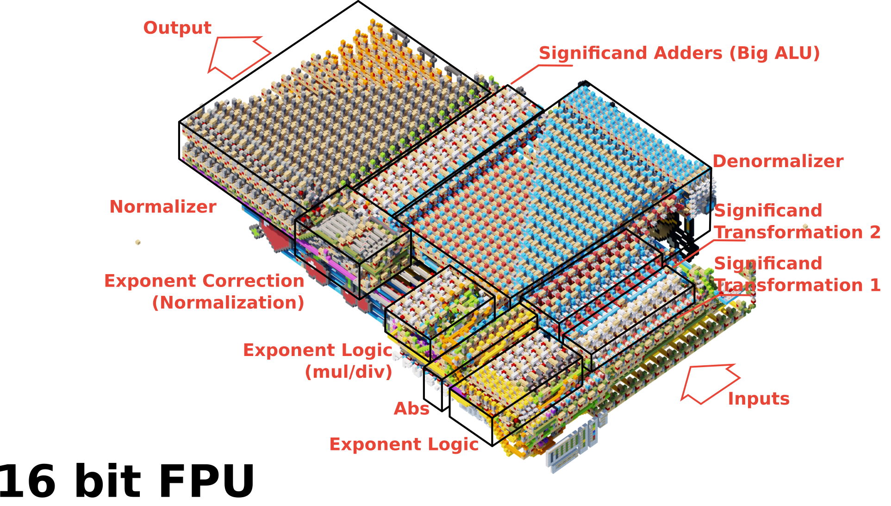
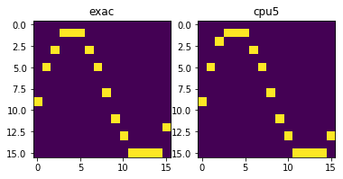

# FPU

[Polish README](README.md)

16 bit FPU made in Minecraft. Authors:

* Lord225
* GwiezdnyKartofel
* BrzechiX


# FPU Functions
FPU is a 16-bit floating-point computing unit developed and built in minecraft - it is capable of
* Addition   (fadd)
* Subtraction (fsub)
* Multiplication    (fmul)
* Dividing   (fdiv)
* Conversion to f16 (itof)
* Conversion to i16 (ftoi)
* Conversion to u16 (ftou)

## Inputs and outputs

| Input A | Input B | Opcode | Output | Flags |
|-----------|-----------|--------|---------|-------|
| 16 bit    | 16 bit    | 3bit   | 16 bit  | 7bit  |

## Flags

| Bit   | Description    |
|-------|----------------|
| 0     | Wrong          |
| 1     | DivByZero      |
| 2     | Inf            |
| 3     | NaN            |
| 4     | Round          |
| 5     | Sub epsilon ops|
| 6     | Sign           |

## Operations

| Operation| OpCode | Input A | Input B | Output |
|----------|--------|-----------|-----------|---------|
| `fadd`     | `001`    | f16       | f16       | f16     |
| `fsub`     | `010`    | f16       | f16       | f16     |
| `fmul`     | `011`    | f16       | f16       | f16     |
| `fdiv`     | `100`    | f16       | f16       | f16     |
| `itof`     | `101`    | -         | i16       | f16     |
| `ftoi`     | `110`    | -         | f16       | i16     |
| `ftou`     | `111`    | -         | f16       | u16     |

FPU is available on the `redstonefun.pl` server under the `/warp fpu` command or `/warp masz_cpu5_w_swoim_fpu`

# Architecture 



The architecture is based on the IEEE 754. It has support for denormalized numbers, NaN, Inf, Sub epsilon operations, rounding is locked to truncation. The FPU is divided into 2 parts
* Exponent logic system
* Mantissa processing system

Depending on the operation, the data runs through the corresponding parts of the layout. The upper part visible in the first image is responsible for addition, subtraction and conversion of float to int. The lower part of the FPU visible from the side is responsible for multiplication (Green circuit), division (Orange) as well as conversion of int to float. The exponent circuit is common to all operations and is also integrated into the control circuit.


# Showcase
[](https://www.youtube.com/watch?v=_oZ8A8Fcuyk)

## Description

### Approximation
The video shows the operation of the FPU. The video shows a program that calculates pade approximations for the function $f(x) = sin(x)$, more precisely it uses the derived formula

$$
sin(x) \approx \frac{2710x-22016}{\left(x-16.25\right)x+282.3}+86.94-9.711x
$$

Which, in code, looks like this (in a simplified way)

```py
def f(x):
    z = 2710 * x
    z = z - 22016
    
    y = x - 16.25
    y = y * x
    y = y + 282.3
    
    o = z / y
    o = o + 86.94

    e = x * 9.711
    o = o - e
    return o
```

The Padé approximation was a forced choice by a problem with the Taylor method - it could not be used by the extremely large values of consecutive words of the series that would be needed to achieve adequate accuracy (for 10 bits of mantissa the FPU lost too much precision). Padé's approximation is better in this case, because it includes dividing by two polynomials, which are able to return a result with much higher accuracy.

### Code of the program

The code was written with the help of the tool https://github.com/Lord225/Lord-s-asm-for-mc which allows you to define non-standard assemblers (For circuits built ad hoc, for entertainment purposes).
```
ENTRY:     
    copy 0x0000 to [0]
    copy 0x0000 to [10]
    copy 0x0010 to [11]
LOOP_START:
    copy [0] to [1]
    fpuuu itof [10] to [1]
    jump to FUNCTION                      //% FUNCTION
RETURN_ADRESS:
    copy [2] to [3]
    copy [0] to [2]
    fpuuu ftoi [3] to [2]
    show [2]
    copy 17 to [0]
    gpuuu set flag        
    copy [10] to [0]
    left shift [2]
    left shift [2]
    left shift [2]
    left shift [2]
    or [2] with [0]
    copy 256 to [9]
    or [9] with [0]
    gpuuu draw pixel
    copy 0 to [0]
    increment [10]
    if [11] > [10] jump to LOOP_START
    break 7
 
FUNCTION:
    // IN      [1]  fp16
    // OUT     [2]  fp16
    // Caller  [10] ----
    copy 0x694B to [2]         // 2710.0
    fpuuu multiply [2] by [1]   // z(r2) = 2710 * x(r1)
    copy 0x7560 to [3]         // 22016
    fpuuu subtract [3] from [2]     // z(r2) = z(r2) - 2216
    copy 0x4C10 to [3]         // 16.25
    copy [1] to [4]            // x(r4) = x(r1) 
    fpuuu subtract [3] from [4]     // y(r4) = x(r4) - 16.25
    fpuuu multiply [4] by [1]   // y(r4) = y(r4) * x(r1)
    copy 0x5C69 to [3]         // 282.3
    fpuuu add [3] to [4]       // y(r4) = y(r4) + 282.3
    fpuuu divide [2] by [4]  // o(r2) = z(r2) / y(r4)
    copy 0x556F to [3]         // 86.94
    fpuuu add [3] to [2]       // o(r2) = o(r2) + 86.94   // D48A 557A
    copy 0x48DD to [3]         // 9.87
    copy [1] to [4]
    fpuuu multiply [4] by [3]
    fpuuu subtract [4] from [2]    
    jump to RETURN_ADRESS
```

### Disassembly `(CPU5)`
```
00000100  00100000  11010010  10010110  copy 0x694B to [2]                   (FUNCTION)       58
10000100  00001000  11000000  00000000  fpuuu multiply [2] by [1]                              60
00001100  00100000  00000110  10101110  copy 0x7560 to [3]                                    62
11000100  00001000  01000000  00000000  fpuuu subtract [3] from [2]                                64
00001100  00100000  00001000  00110010  copy 0x4C10 to [3]                                    66
00101000  11000000                      copy [1] to [4]                                       68
11000010  00001000  01000000  00000000  fpuuu subtract [3] from [4]                                69
10000010  00001000  11000000  00000000  fpuuu multiply [4] by [1]                              71
00001100  00100000  10010110  00111010  copy 0x5C69 to [3]                                    73
11000010  00001000  10000000  00000000  fpuuu add [3] to [4]                                  75
00100100  00001000  00100000  00000000  fpuuu divide [2] by [4]                             77
00001100  00100000  11110110  10101010  copy 0x556F to [3]                                    79
11000100  00001000  10000000  00000000  fpuuu add [3] to [2]                                  81
00001100  00100000  10111011  00010010  copy 0x48DD to [3]                                    83
00101000  11000000                      copy [1] to [4]                                       85
11000010  00001000  11000000  00000000  fpuuu multiply [4] by [3]                              86
00100100  00001000  01000000  00000000  fpuuu subtract [4] od [2]                                88
00000000  11010000  11011000  00000000  jump to RETURN_ADRESS                                  90
```


### Results
The table below shows the results for a 16-bit FPU chip and the expected results from python. Of course, by the reduced precision (16 bits) the results of the FPU deviate from the Python results but this is expected. Nevertheless, the error is insignificant for a 16-bit machine.

The artifacts in the display are due to rounding of the results - after calculating the values, the output is truncated to intger which causes some results to deviate more significantly on the display than in the table.

| x | cpu5 (FPU) |  exac (python)  |
|---|------|--------|
| 0 | 8.69 | 8.95   |
| 1 | 4.875| 4.934  |
| 2 | 1.813| 2.127  |
| 3 | 0.5  | 0.557  |
| 4 | 0.062| 0.192  |
| 5 | 0.875| 0.9332 |
| 6 | 2.5  | 2.604  |
| 7 | 4.875| 4.961  |
| 8 | 7.625| 7.696  |
| 9 | 10.44| 10.48  |
| 10| 13.0 | 12.96  |
| 11| 14.82| 14.83  |
| 12| 16.0 | 15.821 |
| 13| 15.69| 15.743 |
| 14| 14.63| 14.48  |
| 15| 12.25| 11.98  |



