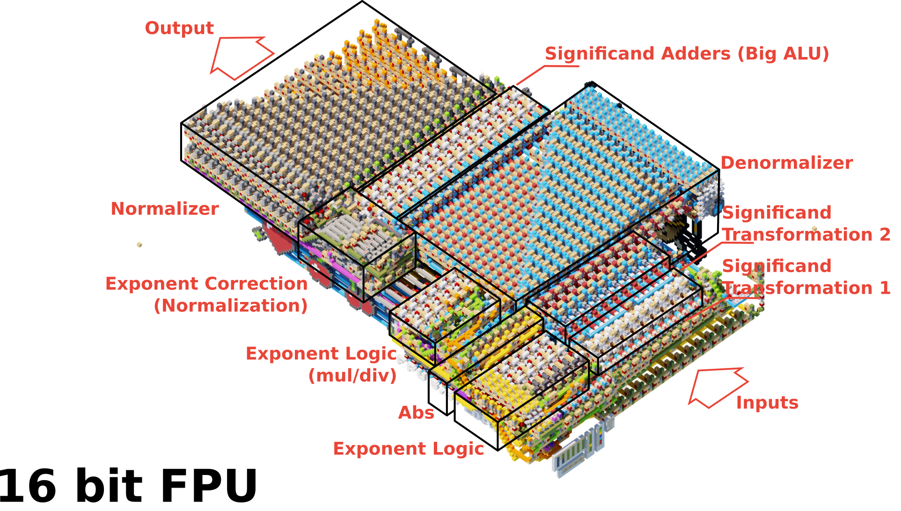
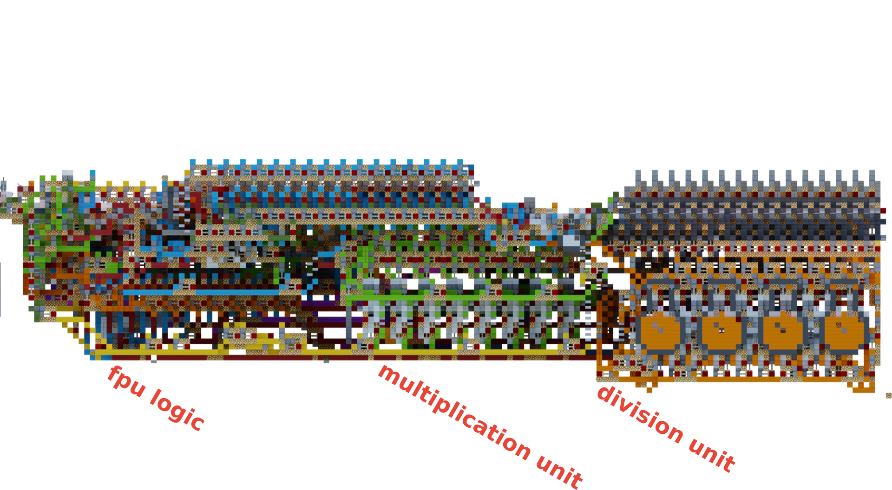
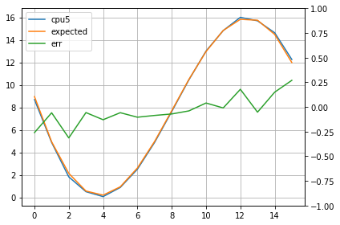
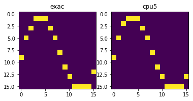

# FPU

Projekt 16 bitowego układu FPU zbudowany w minecraftie. Autorzy

* Lord225
* GwiezdnyKartofel
* BrzechiX


# Funkcje FPU
FPU to 16 bitowy układ do obliczeń zmiennoprzecinkowych opracowany i zbudowany w minecraft'cie - jest on zdolny do
* Dodawania   (fadd)
* Odejmowania (fsub)
* Mnożenia    (fmul)
* Dzielenia   (fdiv)
* Konwersji na f16 (itof)
* Konwersji na i16 (ftoi)
* Konwersji na u16 (ftou)

## Wejścia i wyjścia

| Wejście A | Wejście B | Opcode | Wyjście | Flagi |
|-----------|-----------|--------|---------|-------|
| 16 bit    | 16 bit    | 3bit   | 16 bit  | 7bit  |

## Flagi

| Bit   | Opis           |
|-------|----------------|
| 0     | Wrong          |
| 1     | DivByZero      |
| 2     | Inf            |
| 3     | NaN            |
| 4     | Round          |
| 5     | Sub epsilon ops|
| 6     | Sign           |

## Operacje

| Operacja | OpCode | Wejście A | Wejście B | Wyjście |
|----------|--------|-----------|-----------|---------|
| `fadd`     | `001`    | f16       | f16       | f16     |
| `fsub`     | `010`    | f16       | f16       | f16     |
| `fmul`     | `011`    | f16       | f16       | f16     |
| `fdiv`     | `100`    | f16       | f16       | f16     |
| `itof`     | `101`    | -         | i16       | f16     |
| `ftoi`     | `110`    | -         | f16       | i16     |
| `ftou`     | `111`    | -         | f16       | u16     |

FPU jest dostępne na serwerze `redstonefun.pl` pod komendą `/warp fpu` lub `/warp masz_cpu5_w_swoim_fpu`

# Architektura 



Architektura jest wzorowana na standardzie IEEE 754. Posiada wsparcie dla liczb zdenormalizowanych, NaN, Inf, Sub epsilon operations, zaokrąglanie jest zablokowane na trunckowanie. FPU jest podzielone na 2 części
* System logiki wykładnika
* System przetwarzania mantysy

W zależności od operacji dane przebiegają przez odpowiednie części układu. Górna część widoczna na pierwszym obrazku jest odpowiedzialna za dodawanie, odejmowanie i zamianę float na int. Dolna część układu widoczna od boku jest odpowiedzialna za mnożenie (Zielony układ), dzielenie (Pomarańczowy) jak również zamianę int na float. Układ wykładnika jest wspólny dla wszystkich operacji i jest również zintegrowany z układem sterującym.


# Film demonstracyjny
[](https://www.youtube.com/watch?v=_oZ8A8Fcuyk)

## Opis działania

### Aproksymacja
Film przedstawia działanie układu FPU. W filmie pokazano program obliczający aproksymacje pade'a dla funkcji $f(x) = sin(x)$, dokładniej używa on wyprowadzonego wzoru

$$
sin(x) \approx \frac{2710x-22016}{\left(x-16.25\right)x+282.3}+86.94-9.711x
$$

Co w kodzie wygląda następująco (rozpisanym w uproszczony sposób)

```py
def f(x):
    z = 2710 * x
    z = z - 22016
    
    y = x - 16.25
    y = y * x
    y = y + 282.3
    
    o = z / y
    o = o + 86.94

    e = x * 9.711
    o = o - e
    return o
```

Aproksymacja pade'a była wymuszonym wyborem przez problem z metodą Taylora - nie dało się jej zastosować przez ekstremalnie duże wartości kolejnych wyrazów szeregu, które byłyby potrzebne do uzyskania odpowiedniej dokładności (dla 10 bitów mantysy FPU gubiło za dużo precyzji). Aproksymacja Padé'a jest w tym przypadku lepsza, ponieważ zawiera dzielenie przez dwa wielomiany, które są w stanie zwrócić wynik z dużą większą dokładnością.

### Kod programu

Kod napisany został z pomocą narzędzia https://github.com/Lord225/Lord-s-asm-for-mc które pozwala na definiowanie nietypowych assemblerów (Dla układów zbudowanych ad hoc, w celach rozrywkowych).
```
ENTRY:     
    kopiuj 0x0000 do [0]
    kopiuj 0x0000 do [10]
    kopiuj 0x0010 do [11]
LOOP_START:
    kopiuj [0] do [1]
    fpuuu itof [10] do [1]
    skocz do FUNCTION                      //% FUNCTION
RETURN_ADRESS:
    kopiuj [2] do [3]
    kopiuj [0] do [2]
    fpuuu ftoi [3] do [2]
    wyswietl [2]
    kopiuj 17 do [0]
    gpuuu ustaw flage        
    kopiuj [10] do [0]
    przesun w lewo [2]
    przesun w lewo [2]
    przesun w lewo [2]
    przesun w lewo [2]
    zoruj [2] z [0]
    kopiuj 256 do [9]
    zoruj [9] z [0]
    gpuuu ciapnij piksel
    kopiuj 0 do [0]
    inkrementuj [10]
    jesli [11] > [10] skocz do LOOP_START
    przerywanie 7
 
FUNCTION:
    // IN      [1]  fp16
    // OUT     [2]  fp16
    // Caller  [10] ----
    kopiuj 0x694B do [2]         // 2710.0
    fpuuu pomnoz [2] przez [1]   // z(r2) = 2710 * x(r1)
    kopiuj 0x7560 do [3]         // 22016
    fpuuu odejmij [3] od [2]     // z(r2) = z(r2) - 2216
    kopiuj 0x4C10 do [3]         // 16.25
    kopiuj [1] do [4]            // x(r4) = x(r1) 
    fpuuu odejmij [3] od [4]     // y(r4) = x(r4) - 16.25
    fpuuu pomnoz [4] przez [1]   // y(r4) = y(r4) * x(r1)
    kopiuj 0x5C69 do [3]         // 282.3
    fpuuu dodaj [3] do [4]       // y(r4) = y(r4) + 282.3
    fpuuu podziel [2] przez [4]  // o(r2) = z(r2) / y(r4)
    kopiuj 0x556F do [3]         // 86.94
    fpuuu dodaj [3] do [2]       // o(r2) = o(r2) + 86.94   // D48A 557A
    kopiuj 0x48DD do [3]         // 9.87
    kopiuj [1] do [4]
    fpuuu pomnoz [4] przez [3]
    fpuuu odejmij [4] od [2]    
    skocz do RETURN_ADRESS
```

### Disassembly `(CPU5)`
```
00000100  00100000  11010010  10010110  kopiuj 0x694B do [2]                   (FUNCTION)       58
10000100  00001000  11000000  00000000  fpuuu pomnoz [2] przez [1]                              60
00001100  00100000  00000110  10101110  kopiuj 0x7560 do [3]                                    62
11000100  00001000  01000000  00000000  fpuuu odejmij [3] od [2]                                64
00001100  00100000  00001000  00110010  kopiuj 0x4C10 do [3]                                    66
00101000  11000000                      kopiuj [1] do [4]                                       68
11000010  00001000  01000000  00000000  fpuuu odejmij [3] od [4]                                69
10000010  00001000  11000000  00000000  fpuuu pomnoz [4] przez [1]                              71
00001100  00100000  10010110  00111010  kopiuj 0x5C69 do [3]                                    73
11000010  00001000  10000000  00000000  fpuuu dodaj [3] do [4]                                  75
00100100  00001000  00100000  00000000  fpuuu podziel [2] przez [4]                             77
00001100  00100000  11110110  10101010  kopiuj 0x556F do [3]                                    79
11000100  00001000  10000000  00000000  fpuuu dodaj [3] do [2]                                  81
00001100  00100000  10111011  00010010  kopiuj 0x48DD do [3]                                    83
00101000  11000000                      kopiuj [1] do [4]                                       85
11000010  00001000  11000000  00000000  fpuuu pomnoz [4] przez [3]                              86
00100100  00001000  01000000  00000000  fpuuu odejmij [4] od [2]                                88
00000000  11010000  11011000  00000000  skocz do RETURN_ADRESS                                  90
```


### Wyniki
Tabela poniżej przedstawia wyniki dla 16 bitowego układu FPU i oczekiwane wyniki z pythona. Oczywiście przez zmniejszoną precyzje (16 bitów) wyniki zbudowanej maszyny odbiegają od wzorcowych ale jest to oczekiwane. Mimo to błąd jest nieznaczny jak na 16 bitową maszynę.

Artefakty przy wyświetlaniu wynikają z zaokrągleń wyników - po obliczeniu wartości output jest trunckowany do intgera co powoduje, że niektóre wyniki odbiegają znaczniej na wyświetlaczu niż w tabeli.

| x | cpu5 (FPU) |  exac (python)  |
|---|------|--------|
| 0 | 8.69 | 8.95   |
| 1 | 4.875| 4.934  |
| 2 | 1.813| 2.127  |
| 3 | 0.5  | 0.557  |
| 4 | 0.062| 0.192  |
| 5 | 0.875| 0.9332 |
| 6 | 2.5  | 2.604  |
| 7 | 4.875| 4.961  |
| 8 | 7.625| 7.696  |
| 9 | 10.44| 10.48  |
| 10| 13.0 | 12.96  |
| 11| 14.82| 14.83  |
| 12| 16.0 | 15.821 |
| 13| 15.69| 15.743 |
| 14| 14.63| 14.48  |
| 15| 12.25| 11.98  |





